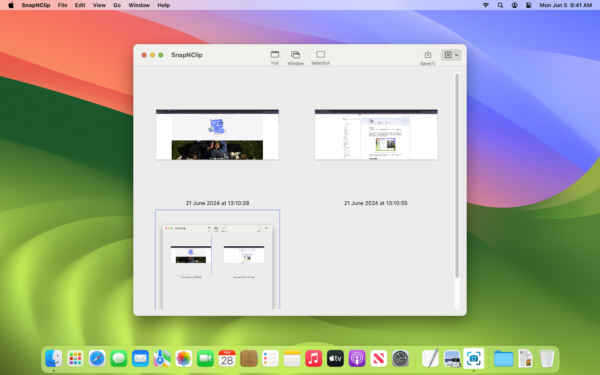
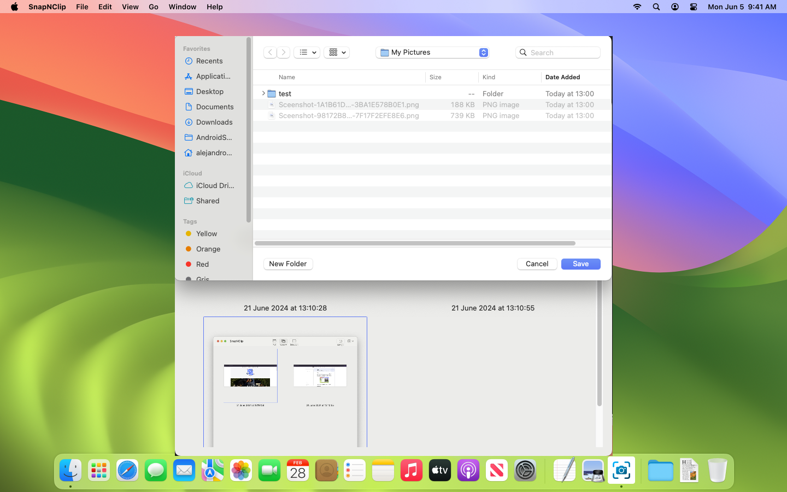
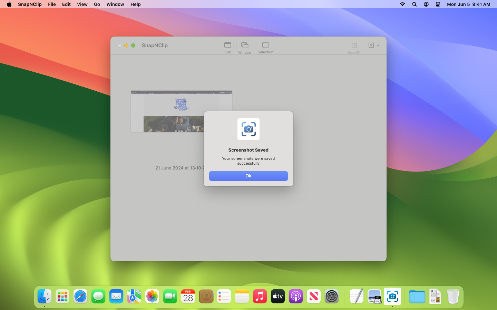

# SnapNClip

A screenshot tool that can help you for Mac.

### Why I built SnapNClip?

This app was built basically with two goals in mind: 
- Learn more about macOS development 
- Make my life a little bit easier in my job

As I was constantly taking screenshots, my desktop usually ended up pretty messy and it was hard to keep track of the useful screenshots and delete the ones that were not necessary.

### How do I use SnapNClip?

1. Click the type of screenshot that you want to take. The app allows you to take these types of screenshots: 
   - Full-Screen screenshot
   - Single Window screenshot
   - Selection screenshot
2. Once you have taken your screenshots, these will appear in the grid. The Clear All Screenshots button now is enabled, if clicked it will delete all the existing screenshots in the app
3. Select any screenshot by clicking on them, this will enable the Save Selected Screenshot(s) and the Delete Selected Screenshot(s).
4. Click on Save Selected Screenshot(s) and select a folder to store your screenshots. After saving the screenshots, they will be automatically removed from the app.

That's it! 

More features will be coming in the future!

### Contact
Do you have any feedback or questions? Send me an email to: alex.hernandezc.21@gmail.com